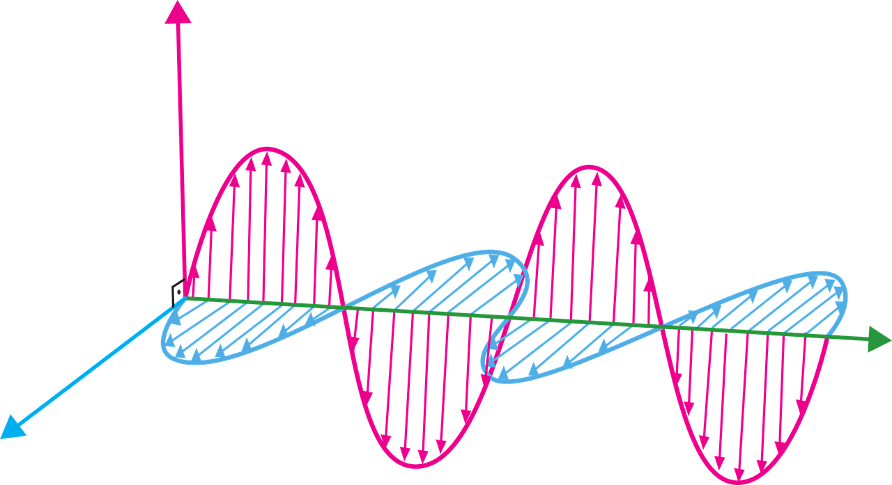

<!--
*** To avoid retyping too much info. Do a search and replace for the following:
*** me2-comb, Multi-Band Combiner, project_description
-->

<!-- PROJECT LOGO -->
 

  

  <h3 align="center">Multi-Band Combiner</h3>

  

    Final Project of ME2
     
    <a href="https://github.com/lucasliano/me2-comb"><strong>Explore the docs »</strong></a>
     
     
    <a href="https://github.com/lucasliano/me2-comb">View Demo</a>
    ·
    <a href="https://github.com/lucasliano/me2-comb/issues">Report Bug</a>
    ·
    <a href="https://github.com/lucasliano/me2-comb/issues">Request Feature</a>
  

<!-- ABOUT THE PROJECT -->
## About The Project

[![Product Name Screen Shot][pcb-screenshot]](https://example.com)

[![Product Name Screen Shot][pcb-3d]](https://example.com)

The objective of this project is to design, simulate, implement and measure a 5-band directional combiner. Therefore, this device must have 5 input ports and a single output. Each input will receive a 500MHz wide bandwidth signal, located at a different carrier frequency, sweeping the range between 0, 5GHz and 4, 5GHz. The output impedance shall be matched to a line impedance of 50Ω.

## Project Rationale
Quantum computing is a novel field of study within science. The aim of quantum computing is to harness some of the principles of elementary particle functioning and apply them to the area of computing. Such computers have the capacity to solve problems that would take a traditional computer decades to solve, but they do not have the capacity to solve traditional problems as efficiently, and require specific hardware to highlight the quantum phenomenology of the particles involved.

At the same time, part of the complexity inherent in this application is the design of directional couplers. These couplers are in charge of mixing different paths of the circuit, keeping the properties of the qubits associated with the process unchanged. This is why the motivation of this project is to take a first step towards the development of these technologies at a national level.

## Built With

* [CST Studio Suite](https://www.3ds.com/es/productos-y-servicios/simulia/productos/cst-studio-suite/)
* [KiCAD](https://www.kicad.org/)

<!-- CONTRIBUTING -->
## Contributing

Contributions are what make the open source community such an amazing place to be learn, inspire, and create. Any contributions you make are **greatly appreciated**.

1. Fork the Project
2. Create your Feature Branch (`git checkout -b feature/AmazingFeature`)
3. Commit your Changes (`git commit -m 'Add some AmazingFeature'`)
4. Push to the Branch (`git push origin feature/AmazingFeature`)
5. Open a Pull Request

<!-- LICENSE -->
## License

Distributed under the MIT License. See `LICENSE` for more information.

<!-- CONTACT -->
## Contact

Lucas Liaño - lliano@frba.utn.edu.ar

Manuel Dieguez - madieguez@frba.utn.edu.ar

Juan Costa Suarez - jcostasurez@frba.utn.edu.ar

Project Link: [https://github.com/lucasliano/me2-comb](https://github.com/lucasliano/me2-comb)

<!-- MARKDOWN LINKS & IMAGES -->
<!-- https://www.markdownguide.org/basic-syntax/#reference-style-links -->
[product-screenshot]: images/screenshot.png
[pcb-screenshot]: images/PCB_3d.png
[pcb-3d]: images/PCB_3d.png
